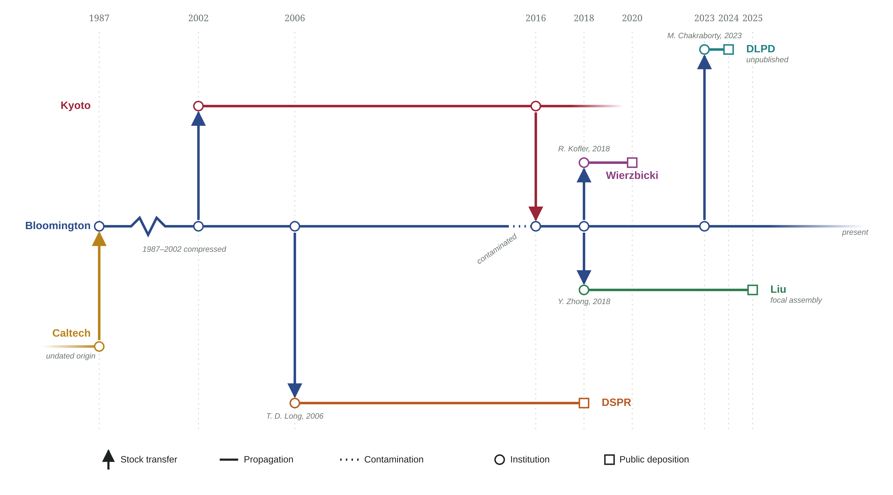

# canton-s-authentication

<!-- TODO: pipeline overview -->

## Table of contents

- [Background](#background)
- [Installation](#installation)
- [Methods](#methods)
  - [Genome acquisition](#genome-acquisition)
  - [Euchromatin extraction](#euchromatin-extraction)
  - [K-mer counting and singleton extraction](#k-mer-counting-and-singleton-extraction)
  - [Jaccard similarity and Mash distance](#jaccard-similarity-and-mash-distance)
  - [Pairwise alignment](#pairwise-alignment)
  - [Windowed nucleotide diversity](#windowed-nucleotide-diversity)
  - [Figure generation](#figure-generation)
- [System requirements](#system-requirements)
- [Benchmark](#benchmark)

## Background

Canton-S has passed through several stock centers and labs since its arrival at Caltech, and its custody chain includes a contamination episode documented by the Bloomington Drosophila Stock Center. Caltech transferred the strain to [Bloomington](https://bdsc.indiana.edu/) on April 1, 1987, which sent it on to the [Kyoto Stock Center](https://kyotofly.kit.jp/) on November 6, 2002 ([DGRC #105666](https://kyotofly.kit.jp/cgi-bin/stocks/search_res_det.cgi?DB_NUM=1&DG_NUM=105666); both dates as recorded in Kyoto's stock entry, which reproduces Bloomington's original accession information). By no later than 2006 (T. D. Long, personal communication), Bloomington had supplied Canton-S to T. D. Long's group, which incorporated it as founder line A1 of what became the Drosophila Synthetic Population Resource (DSPR), later sequenced and assembled by [Chakraborty et al. 2019](https://www.ncbi.nlm.nih.gov/assembly/GCA_003401735.1).

Bloomington's own resident Canton-S stock underwent a contamination episode documented by its record for the current stock, [BDSC #64349](https://bdsc.indiana.edu/Home/Search?presearch=64349): Canton-S was re-added from Kyoto's independently propagated line on February 19, 2016. The onset date was not documented.

Bloomington subsequently supplied stock to the Wierzbicki lab, ordered by R. Kofler on January 16, 2018 (personal communication) and later assembled as [Wierzbicki et al. 2022](https://www.ncbi.nlm.nih.gov/assembly/GCA_015832445.1), and, in 2018, to the laboratory of Yi Zhong, from whom Liu et al. obtained the stock they sequenced and assembled as the ["near-T2T" Canton-S genome](https://www.ncbi.nlm.nih.gov/assembly/GCA_048772135.1) that is the focus of this repository's authentication pipeline. Separately, Mahul Chakraborty obtained Canton-S from Bloomington for the Drosophila Laboratory Pangenome Database (DLPD) project, ordering it on October 25, 2023; Bloomington shipped it on November 2, 2023 (personal communication). The DLPD assembly is unpublished, and its date here is taken from [a pinned version of Chakraborty's DLPD GitHub repository](https://github.com/chakrabortymlab/DLPD/blob/35f1d06cb1fb9b04583c9e980a62f700b91d0ce5/README.md).



**Supplementary Figure S1.** Custody, propagation, and public deposition of Canton-S lineages across stock centers and labs, drawn to a real calendar-year scale from 2002 onward (the 1987–2002 interval is compressed and marked by a break in the Bloomington line). Circles mark an institution or lab taking custody of a stock; squares mark that lineage's public data deposition. Vertical arrows are stock transfers, colored by the lane they leave from; solid horizontal lines are propagation within a lane; the dashed stretch on Bloomington's own line marks its resident stock as contaminated, resolved on February 19, 2016 by a clean transfer back from Kyoto's independently propagated line. Vector source: [`figures/canton_s_provenance.svg`](figures/canton_s_provenance.svg), regenerated by [`code/scripts/render_provenance.sh`](code/scripts/render_provenance.sh).

## Installation

Requires conda or mamba on `PATH` -- neither ships with the OS on any
platform. [Miniforge](https://github.com/conda-forge/miniforge) is a
lightweight installer that defaults to the conda-forge/bioconda
channels this pipeline's `environment.yml` already uses.

Clone the repo and enter it:

```bash
git clone https://github.com/jjemerson/canton-s-authentication.git
cd canton-s-authentication
```

Create the `validate_cs` conda/mamba environment (one-time; skips if it
already exists, `-F` to force recreate):

```bash
./code/scripts/configure.sh
```

Activate it -- required before running any stage or the orchestrator:

```bash
conda activate validate_cs
```

Run the whole pipeline, all seven stages in order:

```bash
./code/scripts/00run_pipeline.sh
```

Pipeline scripts live in `code/scripts/` and expect to be run from the
repo root, as above. See `./code/scripts/00run_pipeline.sh -h` for
running a subset of stages (`-f/--from-stage`, `-o/--only-stage`), or
run any individual `N0_*.sh` script directly for its own options (`-h`
on any of them).

## Methods

Script names below refer to files in `code/scripts/` (e.g.
`10_download_genomes.sh` is `code/scripts/10_download_genomes.sh`).

### Genome acquisition

Assemblies are downloaded according to a control file
(`config/genomes.tsv`) listing each strain, an author-abbreviation
suffix disambiguating multiple independent submissions of the same
strain, a role (focal, reference, or panel), and a source URL. Source
and hosting vary by assembly (NCBI, GitHub, Google Drive), and
downloads run with bounded concurrency to remain courteous to source
servers (`10_download_genomes.sh`).

### Euchromatin extraction

Heterochromatin/euchromatin boundaries for each Muller element (X, 2L,
2R, 3L, 3R), defined on the Release 6 reference assembly following
Hoskins et al. (2015), are lifted onto every target assembly's own
coordinate system via whole-genome alignment with minimap2 (v2.30,
`-cx asm5 --cs`) and paftools.js liftover (minimum mapping quality 30,
minimum alignment length 10 kb), and the corresponding euchromatic
interval is extracted. Liftover is evidence-based rather than a fixed
coordinate offset: alignment blocks are grouped by target contig, and
the boundary is placed using whichever contig actually carries the
aligning support for that arm. An earlier approach padding the Hoskins
boundaries inward by a fixed distance before liftover was tried first
and abandoned -- it failed to generalize across the panel's
heterogeneous assembly quality (`20_extract_euchromatin.sh`,
`code/src/carryover`).

### K-mer counting and singleton extraction

21-mers are counted for each assembly's extracted euchromatin sequence
using Jellyfish. Singleton k-mers -- those occurring exactly once --
are extracted from each count table and sorted; these singleton sets
form the basis of the pairwise distance calculation below
(`30_kmer_count.sh`).

### Jaccard similarity and Mash distance

For every pair of assemblies, the intersection and union of their
singleton k-mer sets give the Jaccard similarity:

$$J = \frac{|A \cap B|}{|A \cup B|}$$

Mash distance is then computed from the Jaccard similarity following
Ondov et al. (2016):

$$D = -\frac{1}{k} \ln\left(\frac{2J}{1+J}\right)$$

where $k$ is the k-mer length (21). All pairwise comparisons across
the panel (21 assemblies, 210 pairs) are computed concurrently
(`40_mash_distance.sh`).

### Pairwise alignment

For a curated subset of comparisons among non-reference assemblies
(not all pairwise combinations), extracted euchromatin sequences are
aligned with minimap2 (`-cx asm10 --cs`) and single-nucleotide
substitutions are called with paftools.js call, restricted to
reference positions covered by exactly one query contig (indels
excluded). Genome-wide nucleotide diversity, reported as substitutions
per callable base, is written to `output/tables/pi_summary.tsv` as a
byproduct of the same call (`50_align_pi.sh`). asm10, not the stricter
asm5 used for liftover in the previous section, since asm5's ~0.1%
divergence tolerance is tuned tighter than real between-genome
*Drosophila* nucleotide diversity (commonly ~0.5-1% genome-wide);
under asm5, more-divergent pairs fragment into many short, ambiguous
alignment blocks, silently dropping a large and systematically
more-divergent-than-average share of the genome from the callable-base
count rather than a random one.

### Windowed nucleotide diversity

Substitution calls are binned into sliding windows (100kb windows,
10kb steps) along each Muller element. A position contributes to a
window's substitution count only if it falls within a region covered
by exactly one contig in the alignment (a callable-coverage mask);
this avoids inflating the apparent substitution rate in
poorly-covered windows (`70_plot_alignment.sh`).

### Figure generation

Three figures summarize the results: a swarm plot of pairwise Mash
distances grouped by comparison category relative to the focal
assembly; a neighbor-joining tree built from the full pairwise Mash
distance matrix, with same-strain groups highlighted; and a grid of
windowed substitution rate across the panel's curated comparisons, one
row per comparison and one column per Muller element
(`60_plot_kmer.sh`, `70_plot_alignment.sh`).

## System requirements

Developed and benchmarked on:

- CPU: AMD Ryzen 9 5950X (16 cores / 32 threads)
- RAM: 128 GiB, DDR4-2666 (2666 MT/s)
- Storage: NVMe SSD
- OS: Pop!_OS 24.04 LTS

**Minimum recommended: 32 GiB RAM, ~50 GB free disk.** Three of the
seven stages peak above 12 GiB resident memory (see benchmark below)
from running several genomes' minimap2/jellyfish jobs concurrently; 16
GiB is workable but leaves little headroom for anything else running
at the same time. Disk is dominated by stage 3's singleton k-mer lists
(~2.2 GB x 21 assemblies, ~46 GB total); a machine with less than ~50
GB free will run out of space partway through stage 3.

## Benchmark

Full pipeline run (`code/scripts/00run_pipeline.sh`, clean clone, all
stage defaults) on the machine above:

| Stage | Script | Wall time |
|---|---|---|
| 1 | `10_download_genomes.sh` | 23s |
| 2 | `20_extract_euchromatin.sh` | 10.7 min |
| 3 | `30_kmer_count.sh` | 6.4 min |
| 4 | `40_mash_distance.sh` | 7.75 min |
| 5 | `50_align_pi.sh` | 63s |
| 6 | `60_plot_kmer.sh` | 3s |
| 7 | `70_plot_alignment.sh` | 27s |
| **Total** | | **~27 min** |

Peak RSS across the whole pipeline (summed over the full concurrent
process tree, not just one stage's worth): **26.14 GiB**.

Notes:
- Stage 1's download concurrency (`-j 4`) is deliberately conservative
  network etiquette, not a resource bottleneck.
- Memory, not time, is the binding constraint on smaller machines --
  total wall-clock is well under an hour even on the above box, but
  stages 2, 3, and 5 each need double-digit GiB of free RAM.
- Verified against a working (non-clean) copy of the pipeline: stage 4's
  `distances.tsv` and stage 5's `pi_summary.tsv` were byte-identical
  between runs.
